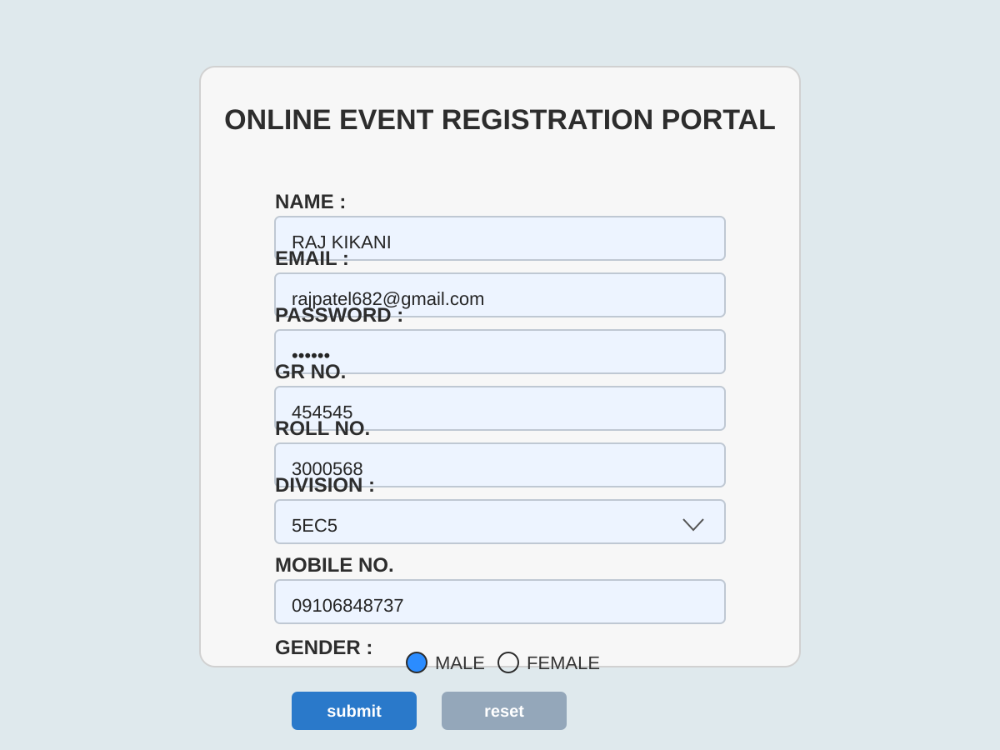

# Pra_04 - ASP.NET Web Application

This project is a simple ASP.NET Web Application created as part of the Pra_04 assignment.

## Project Overview

The application contains a basic ASP.NET web form and related configuration files for running a .NET web project in Visual Studio.

## Project Structure

- `WebApplication1.sln` - Visual Studio solution file
- `WebApplication1.csproj` - Project configuration
- `WebForm1.aspx` - Main web form page
- `WebForm1.aspx.cs` - Code-behind logic
- `WebForm1.aspx.designer.cs` - Designer-generated code
- `Web.config` - Application configuration
- `packages.config` - NuGet package references

## Requirements

- Visual Studio 2019 or later
- .NET Framework compatible with the project
- IIS Express or equivalent local web server

## Run the Project

1. Open the solution file `WebApplication1.sln` in Visual Studio.
2. Restore NuGet packages if needed.
3. Press `F5` to run the application.

## Output Preview

## Notes

This repository includes the project source and necessary configuration for a basic ASP.NET web application demo.

## GitHub Repository

https://github.com/raj6400/Pra_04.git
